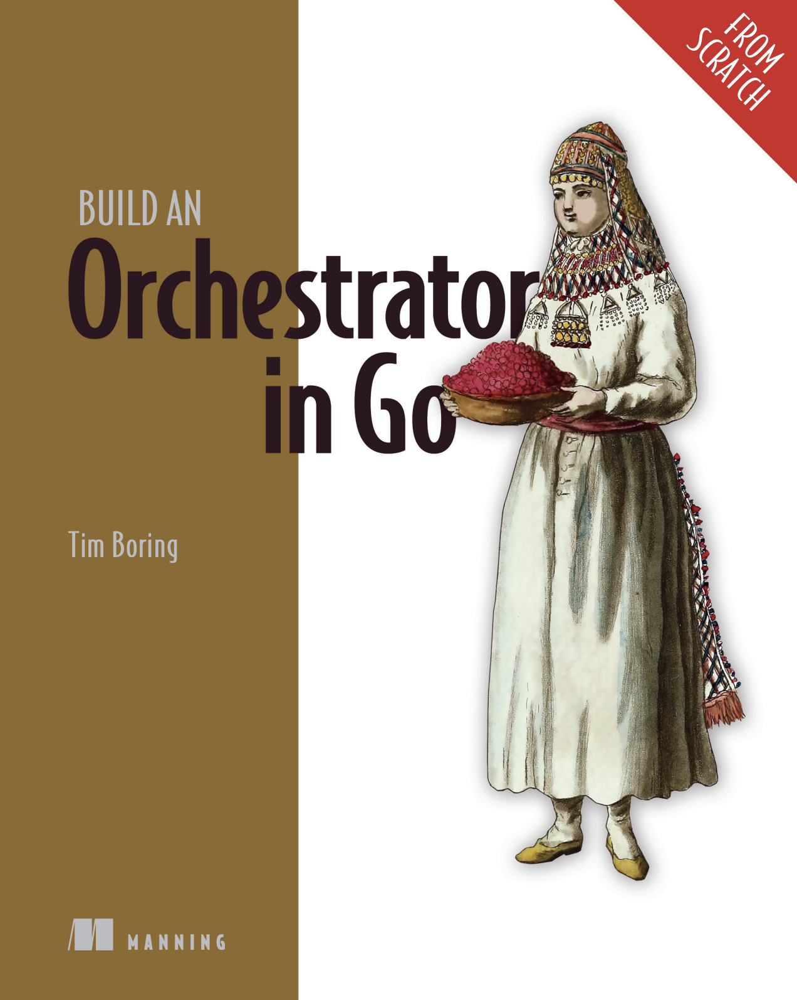

# Build an Orchestrator in Go

Minimal Kubernetes-style orchestrator written in Go. Includes scheduling, service management, and container lifecycle handling, following concepts from Build an Orchestrator in Go.

